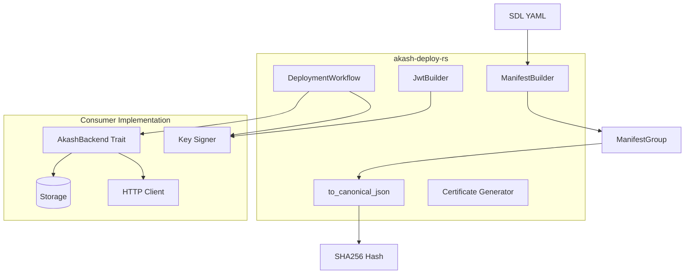
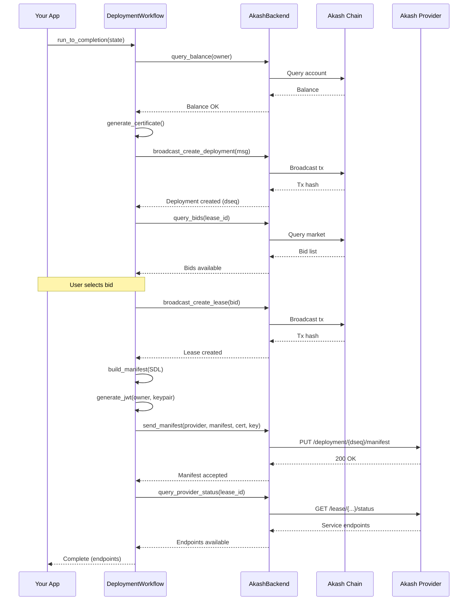

# akash-deploy-rs

[](https://crates.io/crates/akash-deploy-rs)
[](https://docs.rs/akash-deploy-rs)
[](https://github.com/permissionlessweb/akash-deploy-rs)
[](https://github.com/permissionlessweb/akash-deploy-rs)

**Standalone deployment workflow engine for Akash Network.**

Build, authenticate, and deploy applications to Akash using a trait-based state machine. No storage, signing, or transport coupling — bring your own infrastructure.

---

## Features

- **SDL → Manifest** — Parse SDL YAML to provider-ready JSON with correct serialization
- **Canonical JSON** — Deterministic hashing that matches Go provider validation
- **JWT Authentication** — ES256K self-attested tokens for provider communication
- **Certificate Generation** — TLS certs with encrypted private key storage
- **Workflow Engine** — State machine for full deployment lifecycle
- **Backend Agnostic** — Single `AkashBackend` trait, you implement persistence/transport
- **SDL Templates** *(optional)* — Variable substitution for reusable deployment configs

---

## Quick Start

```rust
use akash_deploy_rs::{ManifestBuilder, to_canonical_json};

// 1. Parse SDL to manifest
let manifest_builder = akash_deploy_rs::ManifestBuilder::new(&owner, dseq);
let manifest_groups = manifest_builder.build_from_sdl(sdl_yaml)

// 2. Serialize to canonical JSON (for hash matching)
let canonical_json = to_canonical_json(&manifest_groups)?;

// 3. Compute hash (matches provider validation)
use sha2::{Digest, Sha256};
let hash = Sha256::digest(canonical_json.as_bytes());
```

### Full Workflow Example

```rust
use akash_deploy_rs::{AkashBackend, DeploymentWorkflow, DeploymentState};

// Implement the backend trait with your infrastructure
struct MyBackend { /* your storage, HTTP client, etc. */ }

impl AkashBackend for MyBackend {
    async fn query_balance(&self, address: &str) -> Result<u64, DeployError> {
        // Your chain query implementation
    }
    // ... other methods
}

// Run deployment workflow
let backend = MyBackend::new();
let signer = MySigner::new();
let workflow = DeploymentWorkflow::new(&backend, &signer, Default::default());

let mut state = DeploymentState::new("session-1", "akash1owner...")
    .with_sdl(sdl_content)
    .with_label("my-app");

match workflow.run_to_completion(&mut state).await? {
    StepResult::Complete => println!("Deployed!"),
    StepResult::NeedsInput(input) => { /* handle user decisions */ }
    _ => {}
}
```

---

## Architecture



### Components

| Component | Purpose | Dependencies |
|-----------|---------|--------------|
| **ManifestBuilder** | SDL parsing → JSON manifest | None |
| **to_canonical_json** | Deterministic JSON serialization | None |
| **JwtBuilder** | ES256K JWT construction | Consumer provides signing |
| **CertificateGenerator** | TLS cert generation | None |
| **DeploymentWorkflow** | State machine orchestration | AkashBackend trait |

---

## Deployment Workflow



---

## Critical Serialization Details

Provider JSON API has strict requirements. `ManifestBuilder` handles these correctly:

| Requirement | Implementation |
|-------------|----------------|
| CPU units | STRING millicores: `"1000"` not `1.0` |
| Memory/storage | STRING bytes: `"536870912"` not int |
| Empty arrays | `null` not `[]` for command/args/env |
| Field names | camelCase: `externalPort` not `external_port` |
| GPU attributes | Composite keys: `vendor/nvidia/model/h100/ram/80Gi` |
| Storage attributes | Sorted by key |
| Services | Sorted by name |

**Canonical JSON is required** — Go's `encoding/json` sorts keys, we must match for hash validation.

---

## Design Principles

1. **Single Trait** — `AkashBackend` is the only interface
2. **Bring Your Own Infrastructure** — No storage, HTTP, or signing coupling
3. **State Machine Focused** — Workflow orchestrates, you implement primitives
4. **Explicit Errors** — `DeployError` covers all failure modes
5. **Type Safety** — Correct manifest serialization enforced at compile time

---

## SDL Templates (Optional Feature)

Enable with the `sdl-templates` feature flag:

```toml
[dependencies]
akash-deploy-rs = { version = "0.0.1", features = ["sdl-templates"] }
```

SDL templates allow you to create reusable deployment configurations with variable placeholders using `${VAR}` syntax:

```yaml
version: "2.0"
services:
  web:
    image: ${IMAGE}:${VERSION}
    expose:
      - port: ${PORT}
        as: ${PORT}
        to:
          - global: true
profiles:
  compute:
    web:
      resources:
        cpu:
          units: ${CPU_UNITS}
        memory:
          size: ${MEMORY_SIZE}
        storage:
          size: ${STORAGE_SIZE}
  placement:
    dcloud:
      pricing:
        web:
          denom: uakt
          amount: ${PRICE}
deployment:
  web:
    dcloud:
      profile: web
      count: ${COUNT}
```

### Usage

```rust
use akash_deploy_rs::{DeploymentState, SdlTemplate, TemplateVariables, TemplateDefaults};
use std::collections::HashMap;

// Define defaults
let mut defaults = TemplateDefaults::new();
defaults.insert("IMAGE".to_string(), "nginx".to_string());
defaults.insert("VERSION".to_string(), "1.25".to_string());
defaults.insert("PORT".to_string(), "80".to_string());
defaults.insert("CPU_UNITS".to_string(), "100m".to_string());
defaults.insert("MEMORY_SIZE".to_string(), "128Mi".to_string());
defaults.insert("STORAGE_SIZE".to_string(), "1Gi".to_string());
defaults.insert("PRICE".to_string(), "100".to_string());
defaults.insert("COUNT".to_string(), "1".to_string());

// User overrides (optional)
let mut variables = TemplateVariables::new();
variables.insert("VERSION".to_string(), "1.26".to_string());
variables.insert("PORT".to_string(), "8080".to_string());

// Create deployment with template
let state = DeploymentState::new("session-1", "akash1owner...")
    .with_sdl(template_content)
    .with_template(defaults)
    .with_variables(variables);

// Workflow processes template automatically at SendManifest step
workflow.run_to_completion(&mut state).await?;
```

### Template Features

- **Variable Syntax**: `${VARIABLE_NAME}` — alphanumeric characters and underscores only
- **Strict Validation**: All variables must have defaults (enforced at processing time)
- **Priority**: User variables override defaults
- **YAML-Aware**: Preserves document structure during substitution
- **Error Handling**: Clear error messages for missing defaults, unclosed placeholders, invalid variable names

### Direct Template Processing

You can also process templates directly without the workflow:

```rust
use akash_deploy_rs::{SdlTemplate, ManifestBuilder};

let template = SdlTemplate::new(template_content)?;

// Validate all variables have defaults
template.validate(&defaults)?;

// Process with overrides
let processed_sdl = template.process(&variables, &defaults)?;

// Build manifest from processed SDL
let builder = ManifestBuilder::new("akash1owner", 123);
let manifest = builder.build_from_sdl(&processed_sdl)?;
```

---

## Testing

Unit tests for manifest building and JWT generation:

```bash
cargo test -p akash-deploy
```

Integration tests against real Go provider validation:

```bash
cd tests
just test
```

---

## E2E Testing

The `tests/` directory contains a complete integration test suite that validates manifest generation against the actual Akash provider validation code:

- **`provider-validate`** — Go binary using exact provider logic (ES256K JWT + manifest validation)
- **`fixtures/`** — Known-good JWT/manifest/hash test cases
- **`testdata/`** — SDL YAML files for testing
- **`examples/rust-jwt-gen/`** — Rust example that generates JWTs using `akash-deploy`
- **`test.sh`** — End-to-end test: Rust generates → Go validates

This ensures byte-for-byte compatibility with Akash provider expectations.

---

## TODO

- [ ] Wire in chain-sdk-rs types for protobuf messages
- [ ] Add more SDL parsing examples
- [ ] Document AkashBackend trait methods in detail
