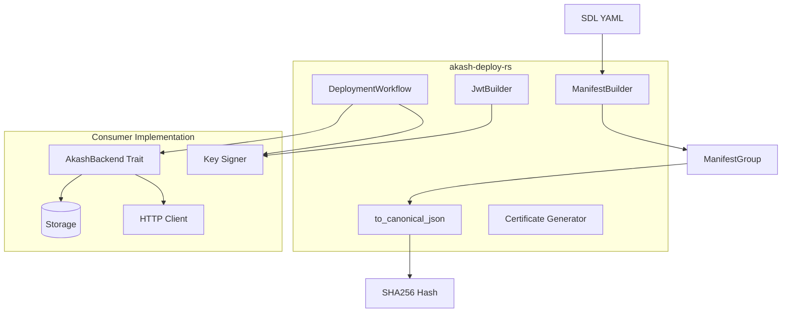
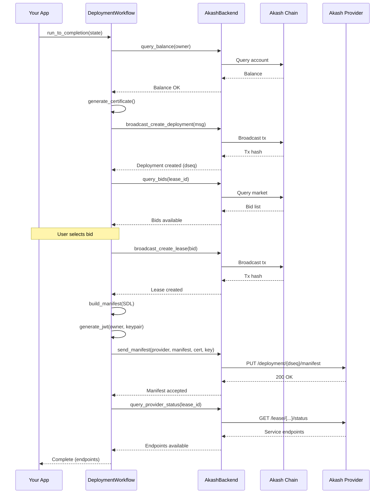

# akash-deploy-rs

[](https://crates.io/crates/akash-deploy-rs)
[](https://docs.rs/akash-deploy-rs)
[](https://github.com/permissionlessweb/akash-deploy-rs)
[](https://github.com/permissionlessweb/akash-deploy-rs)

**Standalone deployment workflow engine for Akash Network.**

Build, authenticate, and deploy applications to Akash using a trait-based state machine. No storage, signing, or transport coupling — bring your own infrastructure.

---

## Features

- **SDL → Manifest** — Parse SDL YAML to provider-ready JSON with correct serialization
- **Canonical JSON** — Deterministic hashing that matches Go provider validation
- **JWT Authentication** — ES256K self-attested tokens for provider communication
- **Certificate Generation** — TLS certs with encrypted private key storage
- **Workflow Engine** — State machine for full deployment lifecycle
- **Backend Agnostic** — Single `AkashBackend` trait, you implement persistence/transport
- **SDL Templates** — Variable substitution for reusable deployment configs (default)
- **Default Client** — Integrated layer-climb client with file-backed storage (opt-in)

---

## Quick Start

```rust
use akash_deploy_rs::{ManifestBuilder, to_canonical_json};

// 1. Parse SDL to manifest
let manifest_builder = akash_deploy_rs::ManifestBuilder::new(&owner, dseq);
let manifest_groups = manifest_builder.build_from_sdl(sdl_yaml)

// 2. Serialize to canonical JSON (for hash matching)
let canonical_json = to_canonical_json(&manifest_groups)?;

// 3. Compute hash (matches provider validation)
use sha2::{Digest, Sha256};
let hash = Sha256::digest(canonical_json.as_bytes());
```

### Full Workflow Example

```rust
use akash_deploy_rs::{AkashBackend, DeploymentWorkflow, DeploymentState};

// Implement the backend trait with your infrastructure
struct MyBackend { /* your storage, HTTP client, etc. */ }

impl AkashBackend for MyBackend {
    async fn query_balance(&self, address: &str) -> Result<u64, DeployError> {
        // Your chain query implementation
    }
    // ... other methods
}

// Run deployment workflow
let backend = MyBackend::new();
let signer = MySigner::new();
let workflow = DeploymentWorkflow::new(&backend, &signer, Default::default());

let mut state = DeploymentState::new("session-1", "akash1owner...")
    .with_sdl(sdl_content)
    .with_label("my-app");

match workflow.run_to_completion(&mut state).await? {
    StepResult::Complete => println!("Deployed!"),
    StepResult::NeedsInput(input) => { /* handle user decisions */ }
    _ => {}
}
```

---

## Architecture



### Components

| Component | Purpose | Dependencies |
|-----------|---------|--------------|
| **ManifestBuilder** | SDL parsing → JSON manifest | None |
| **to_canonical_json** | Deterministic JSON serialization | None |
| **JwtBuilder** | ES256K JWT construction | Consumer provides signing |
| **CertificateGenerator** | TLS cert generation | None |
| **DeploymentWorkflow** | State machine orchestration | AkashBackend trait |

---

## Deployment Workflow



---

## Critical Serialization Details

Provider JSON API has strict requirements. `ManifestBuilder` handles these correctly:

| Requirement | Implementation |
|-------------|----------------|
| CPU units | STRING millicores: `"1000"` not `1.0` |
| Memory/storage | STRING bytes: `"536870912"` not int |
| Empty arrays | `null` not `[]` for command/args/env |
| Field names | camelCase: `externalPort` not `external_port` |
| GPU attributes | Composite keys: `vendor/nvidia/model/h100/ram/80Gi` |
| Storage attributes | Sorted by key |
| Services | Sorted by name |

**Canonical JSON is required** — Go's `encoding/json` sorts keys, we must match for hash validation.

---

## Design Principles

1. **Single Trait** — `AkashBackend` is the only interface
2. **Bring Your Own Infrastructure** — No storage, HTTP, or signing coupling
3. **State Machine Focused** — Workflow orchestrates, you implement primitives
4. **Explicit Errors** — `DeployError` covers all failure modes
5. **Type Safety** — Correct manifest serialization enforced at compile time

---

## SDL Templates

SDL templates are enabled by default. To opt out, disable default features:

```toml
[dependencies]
akash-deploy-rs = { version = "0.0.1", default-features = false }
```

SDL templates allow you to create reusable deployment configurations with variable placeholders using `${VAR}` syntax:

```yaml
version: "2.0"
services:
  web:
    image: ${IMAGE}:${VERSION}
    expose:
      - port: ${PORT}
        as: ${PORT}
        to:
          - global: true
profiles:
  compute:
    web:
      resources:
        cpu:
          units: ${CPU_UNITS}
        memory:
          size: ${MEMORY_SIZE}
        storage:
          size: ${STORAGE_SIZE}
  placement:
    dcloud:
      pricing:
        web:
          denom: uakt
          amount: ${PRICE}
deployment:
  web:
    dcloud:
      profile: web
      count: ${COUNT}
```

### Usage

```rust
use akash_deploy_rs::{DeploymentState, SdlTemplate, TemplateVariables, TemplateDefaults};
use std::collections::HashMap;

// Define defaults
let mut defaults = TemplateDefaults::new();
defaults.insert("IMAGE".to_string(), "nginx".to_string());
defaults.insert("VERSION".to_string(), "1.25".to_string());
defaults.insert("PORT".to_string(), "80".to_string());
defaults.insert("CPU_UNITS".to_string(), "100m".to_string());
defaults.insert("MEMORY_SIZE".to_string(), "128Mi".to_string());
defaults.insert("STORAGE_SIZE".to_string(), "1Gi".to_string());
defaults.insert("PRICE".to_string(), "100".to_string());
defaults.insert("COUNT".to_string(), "1".to_string());

// User overrides (optional)
let mut variables = TemplateVariables::new();
variables.insert("VERSION".to_string(), "1.26".to_string());
variables.insert("PORT".to_string(), "8080".to_string());

// Create deployment with template
let state = DeploymentState::new("session-1", "akash1owner...")
    .with_sdl(template_content)
    .with_template(defaults)
    .with_variables(variables);

// Workflow processes template automatically at SendManifest step
workflow.run_to_completion(&mut state).await?;
```

### Template Features

- **Variable Syntax**: `${VARIABLE_NAME}` — alphanumeric characters and underscores only
- **Strict Validation**: All variables must have defaults (enforced at processing time)
- **Priority**: User variables override defaults
- **YAML-Aware**: Preserves document structure during substitution
- **Error Handling**: Clear error messages for missing defaults, unclosed placeholders, invalid variable names

### Direct Template Processing

You can also process templates directly without the workflow:

```rust
use akash_deploy_rs::{SdlTemplate, ManifestBuilder};

let template = SdlTemplate::new(template_content)?;

// Validate all variables have defaults
template.validate(&defaults)?;

// Process with overrides
let processed_sdl = template.process(&variables, &defaults)?;

// Build manifest from processed SDL
let builder = ManifestBuilder::new("akash1owner", 123);
let manifest = builder.build_from_sdl(&processed_sdl)?;
```

---

## Default Client & Storage

The library includes a complete, integrated client implementation (NOT enabled by default):

```toml
[dependencies]
akash-deploy-rs {version = "0.0.4", features = ["default-client"]}# Includes default-client feature
```

### Quick Start with Default Client

```rust
use akash_deploy_rs::{AkashClient, DeploymentWorkflow, DeploymentState};

# async fn example() -> Result<(), Box<dyn std::error::Error>> {
// Create client with mnemonic and RPC endpoint
let client = AkashClient::new_from_mnemonic(
    "your twelve word mnemonic phrase here",
    "https://rpc.akashnet.net:443"
).await?;

// Create workflow
let workflow = DeploymentWorkflow::new(
    &client,
    client.signer(),
    Default::default()
);

// Deploy
let mut state = DeploymentState::new("my-app", client.address())
    .with_sdl(sdl_content);

workflow.run_to_completion(&mut state).await?;
# Ok(())
# }
```

### Storage System

The default client uses a **memory + file** persistence strategy:

**Storage Layout:**

```
~/.akash-deploy/
  sessions/
    my-app.json         # Deployment state
    production.json
  certs/
    akash1xxx.key       # Encrypted private keys
  providers.json        # Provider cache
  certificates.json     # Certificate cache
```

**Key Features:**

- **In-Memory Cache**: Fast access to active sessions
- **File Persistence**: Durable storage survives restarts
- **Export/Import**: Backup and restore sessions
- **Generic Design**: Swap storage backends via traits

### Session Management

```rust
// List all sessions
let sessions = client.storage().list_sessions().await?;

// Load a previous session
let state = client.storage().load_session("my-app").await?;

// Export sessions for backup
export_sessions(&client, "/path/to/backup").await?;

// Import sessions from backup
import_sessions(&mut client, "/path/to/backup").await?;
```

### Custom Storage Implementation

Implement the `SessionStorage` trait for custom backends:

```rust
use akash_deploy_rs::storage::SessionStorage;
use async_trait::async_trait;

struct DatabaseStorage {
    pool: sqlx::PgPool,
}

#[async_trait]
impl SessionStorage for DatabaseStorage {
    async fn save_session(&mut self, session: &DeploymentState) -> Result<(), DeployError> {
        sqlx::query!("INSERT INTO sessions (id, data) VALUES ($1, $2)")
            .bind(&session.session_id)
            .bind(serde_json::to_value(session)?)
            .execute(&self.pool)
            .await?;
        Ok(())
    }

    async fn load_session(&self, session_id: &str) -> Result<Option<DeploymentState>, DeployError> {
        let row = sqlx::query!("SELECT data FROM sessions WHERE id = $1", session_id)
            .fetch_optional(&self.pool)
            .await?;

        Ok(row.map(|r| serde_json::from_value(r.data).unwrap()))
    }

    // ... implement other methods
}

// Use custom storage
let client = AkashClient::with_storage(
    layer_climb_client,
    DatabaseStorage { pool },
    address
);
```

### Opt Out of Default Client

To use only the core workflow engine without the integrated client:

```toml
[dependencies]
akash-deploy-rs = { version = "0.0.3" }
```

Then implement `AkashBackend` yourself as shown in the architecture section.

---

## Testing

Unit tests for manifest building and JWT generation:

```bash
cargo test -p akash-deploy
```

Integration tests against real Go provider validation:

```bash
cd tests
just test
```

---

## E2E Testing

The `tests/` directory contains a complete integration test suite that validates manifest generation against the actual Akash provider validation code:

- **`provider-validate`** — Go binary using exact provider logic (ES256K JWT + manifest validation)
- **`fixtures/`** — Known-good JWT/manifest/hash test cases
- **`testdata/`** — SDL YAML files for testing
- **`examples/rust-jwt-gen/`** — Rust example that generates JWTs using `akash-deploy`
- **`test.sh`** — End-to-end test: Rust generates → Go validates

This ensures byte-for-byte compatibility with Akash provider expectations.

---

## Development with Claude Code

This repository includes a specialized Claude skill that provides deep expertise in Akash manifest serialization and provider validation.

### Installing the Skill

The `akash-manifest-spec` skill contains:
- 7 critical serialization rules for manifest generation
- Provider validation procedures using actual Go code
- Debugging decision trees for hash mismatches
- Task-specific implementation checklists

**To install:**

```bash
# Clone the skill to your Claude skills directory
git clone https://github.com/permissionlessweb/akash-deploy-rs.git
ln -s "$(pwd)/akash-deploy-rs/.claude/skills/akash-manifest-spec" ~/.claude/skills/

# Or copy it directly
cp -r .claude/skills/akash-manifest-spec ~/.claude/skills/
```

**When to use:**

The skill activates automatically when you mention:
- "manifest serialization"
- "provider validation"
- "hash mismatch"
- "canonical JSON"
- Akash deployment debugging

It provides structured guidance for:
- Implementing new manifest features while maintaining provider compatibility
- Debugging manifest hash mismatches with actual provider validation code
- Understanding the 7 critical rules (camelCase, null arrays, string numbers, sorting)
- Verifying Rust output matches Go provider expectations byte-for-byte

### Manifest Validation Testing

The skill references the integration test suite in `tests/`:

```bash
cd tests
just test  # Run all SDL test cases through provider validation
```

This validates that your Rust code produces **identical** output to Go providers, ensuring deployments will succeed.

---

## TODO

- [ ] Add more SDL parsing examples
- [ ] Implement Storage Write And Load To File For Deployment Instances
- [ ] Document AkashBackend trait methods in detail
