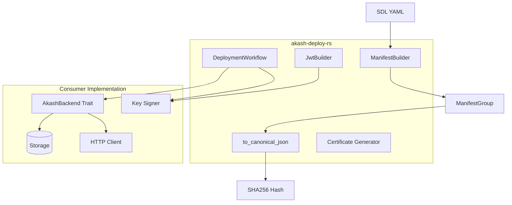
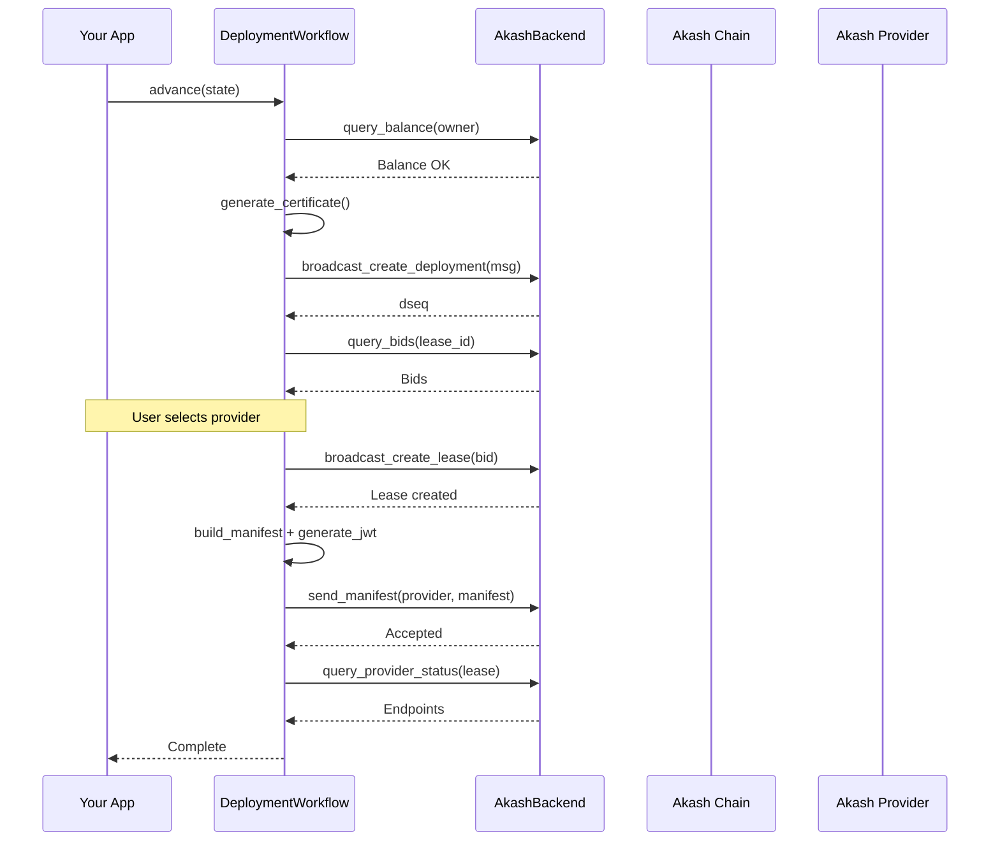

# akash-deploy-rs

Standalone, trait-based Akash deployment workflow engine. No framework coupling.

## Install

Core only (SDL parsing, manifest building, workflow engine):

```toml
[dependencies]
akash-deploy-rs = { version = "0.0.6" }
```

Full client with gRPC, signing, and file storage:

```toml
[dependencies]
akash-deploy-rs = { version = "0.0.6", features = ["default-client", "file-storage"] }
```

## Quick Start

```rust
use akash_deploy_rs::*;

#[tokio::main]
async fn main() -> Result<(), Box<dyn std::error::Error>> {
    let mnemonic = std::env::var("TEST_MNEMONIC")?;
    let client = AkashClient::new_from_mnemonic(
        &mnemonic, "https://rpc.akashnet.net:443", "https://grpc.akashnet.net:443",
    ).await?;
    let signer = KeySigner::new_mnemonic_str(&mnemonic, None)
        .map_err(|e| format!("signer: {e:?}"))?;

    let sdl = std::fs::read_to_string("deploy.yaml")?;
    let mut state = DeploymentState::new("my-app", client.address()).with_sdl(&sdl);
    let workflow = DeploymentWorkflow::new(&client, &signer, Default::default());

    loop {
        match workflow.advance(&mut state).await? {
            StepResult::Continue => continue,
            StepResult::NeedsInput(InputRequired::SelectProvider { bids }) => {
                DeploymentWorkflow::<AkashClient>::select_provider(&mut state, &bids[0].provider)?;
            }
            StepResult::Complete => { break; }
            StepResult::Failed(reason) => return Err(reason.into()),
            _ => {}
        }
    }
    Ok(())
}
```

## Features

| Feature | Default | What it enables |
|---------|---------|-----------------|
| `sdl-templates` | yes | `${VAR}` template substitution in SDL files |
| `default-client` | no | AkashClient (layer-climb gRPC, HD signing, reqwest HTTP) |
| `file-storage` | no | FileDeploymentStore, FileBackedStorage |
| `log-streaming` | no | WsLogStream (WebSocket provider logs) |
| `rpc` | no | tonic gRPC stubs (Console API + Akash protos) |

## Proto refresh (chain-sdk bumps)

Akash wire types live under `src/gen/`, generated by the in-tree prost toolchain from protos vendored out of sibling **`chain-sdk`**.

```bash
just gen-proto-fresh   # sync-protos + modvendor (k8s) + gen-proto
cargo chec
just test-unit
```

Details: [`docs/proto-sync.md`](docs/proto-sync.md).
| `python` | no | PyO3 bindings |

## Architecture


```mermaid
flowchart TB
    SDL[SDL YAML] --> MB[ManifestBuilder]
    MB --> MG[ManifestGroup]
    MG --> CJ[to_canonical_json]
    CJ --> Hash[SHA256 Hash]

    subgraph akash-deploy-rs
        MB
        CJ
        JB[JwtBuilder]
        CG[Certificate Generator]
        WF[DeploymentWorkflow]
    end

    subgraph Consumer Implementation
        Backend[AkashBackend Trait]
        Storage[(Storage)]
        HTTP[HTTP Client]
        Signer[Key Signer]
    end

    WF --> Backend
    Backend --> Storage
    Backend --> HTTP
    WF --> Signer
    JB --> Signer
```

## Deployment Workflow


```mermaid
sequenceDiagram
    participant App as Your App
    participant WF as DeploymentWorkflow
    participant Backend as AkashBackend
    participant Chain as Akash Chain
    participant Provider as Akash Provider

    App->>WF: advance(state)

    WF->>Backend: query_balance(owner)
    Backend-->>WF: Balance OK

    WF->>WF: generate_certificate()

    WF->>Backend: broadcast_create_deployment(msg)
    Backend-->>WF: dseq

    WF->>Backend: query_bids(lease_id)
    Backend-->>WF: Bids

    Note over WF,App: User selects provider

    WF->>Backend: broadcast_create_lease(bid)
    Backend-->>WF: Lease created

    WF->>WF: build_manifest + generate_jwt

    WF->>Backend: send_manifest(provider, manifest)
    Backend-->>WF: Accepted

    WF->>Backend: query_provider_status(lease)
    Backend-->>WF: Endpoints

    WF-->>App: Complete
```

## Manifest-Only Usage

```rust
use akash_deploy_rs::{ManifestBuilder, to_canonical_json};

let builder = ManifestBuilder::new(&owner, dseq);
let groups = builder.build_from_sdl(sdl_yaml)?;
let json = to_canonical_json(&groups)?;
```

## Custom Backend

Implement `AkashBackend` to bring your own transport and storage:

```rust
struct MyBackend { /* ... */ }
impl AkashBackend for MyBackend {
    type Signer = MySigner;
    // query_balance, broadcast_create_deployment, send_manifest, etc.
}
```

## Manifest Serialization Rules

Provider validation requires byte-identical JSON. `ManifestBuilder` handles all of these:

| Rule | Detail |
|------|--------|
| CPU units | String millicores: `"1000"` not `1.0` |
| Memory/storage sizes | String bytes: `"536870912"` not int |
| Memory/storage field name | `"size"` (Go JSON tag), not `"quantity"` (proto) |
| Empty arrays | `null` not `[]` for command/args/env |
| Field names | camelCase: `externalPort`, `httpOptions`, `readOnly` |
| GPU attributes | Composite keys: `vendor/nvidia/model/h100/ram/80Gi` |
| Storage attributes | Sorted by key |
| Services | Sorted by name |
| Resource endpoints | Only global exposes; GroupSpec `kind = 0` (SHARED_HTTP) |

## JWT Authentication

Akash providers use self-attested ES256K JWTs. No challenge-response -- each request is validated against the on-chain public key. The workflow handles this during `EnsureAuth`.

```rust
let claims = JwtClaims::new("akash1youraddress...");
let jwt = JwtBuilder::new().build_and_sign(&claims, |msg| signer.sign(msg))?;
```

## SDL Templates

Enabled by default. Use `${VAR}` placeholders:

```yaml
services:
  web:
    image: ${IMAGE}:${VERSION}
    expose:
      - port: ${PORT}
        as: ${PORT}
        to:
          - global: true
```

```rust
let template = SdlTemplate::new(template_content)?;
template.validate(&defaults)?;
let processed = template.process(&variables, &defaults)?;
```

## Testing

| Command | What it runs | Requires |
|---------|-------------|----------|
| `just test` | All tests (unit + e2e) | Go toolchain |
| `just test-unit` | Unit tests only | -- |
| `just test-e2e` | Rust manifest/JWT vs Go provider validation | Go toolchain |
| `just test-jwt` | JWT signing vs Go `AuthProcess()` | Go toolchain |
| `just test-manifest` | Manifest hash vs Go `Manifest.Version` | Go toolchain |
| `just test-one <file>` | Single SDL through provider validation | Go toolchain |
| `just test-live` | Full deployment on live network | `TEST_MNEMONIC` |
| `just demo` | Live E2E deployment demo | `TEST_MNEMONIC` |
| `just coverage` | Coverage report | `cargo-tarpaulin` |

For live tests, copy `tests/.env.example` to `tests/.env` with your mnemonic.

## Claude Skill

This repo includes `.claude/skills/akash-manifest-spec` for agent-assisted development:

```bash
ln -s /path/to/akash-deploy-rs/.claude/skills/akash-manifest-spec ~/.claude/skills/
```

Activates on manifest serialization, provider validation, hash mismatch, and canonical JSON topics.

## License

MIT OR Apache-2.0
